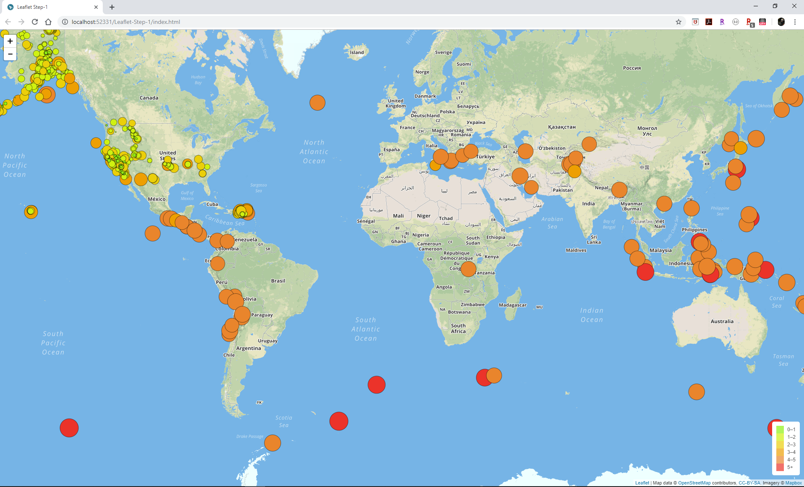
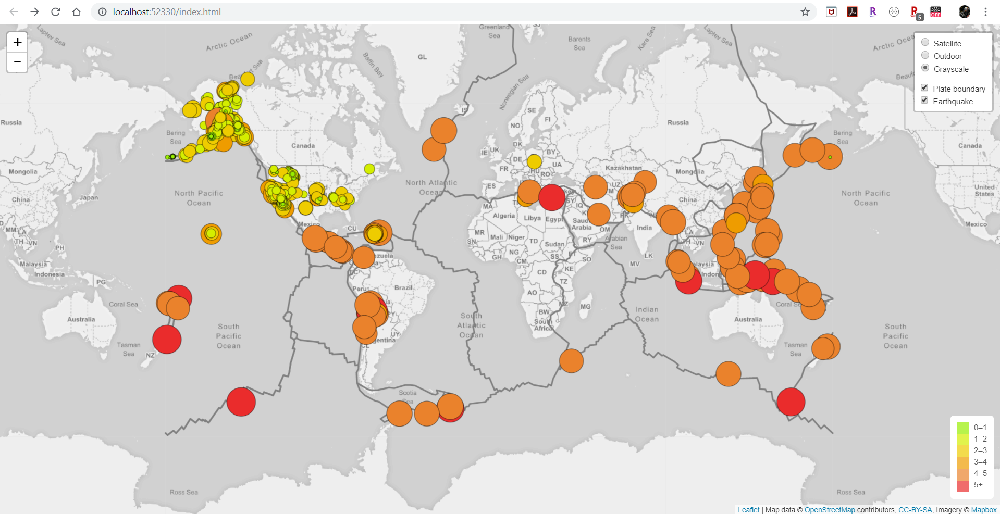
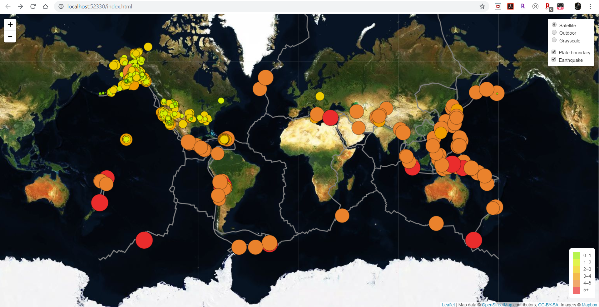
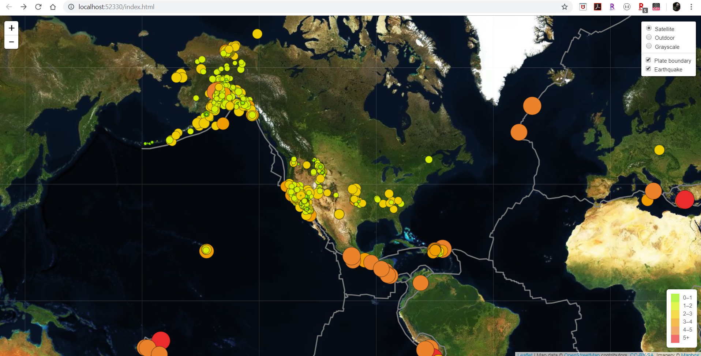
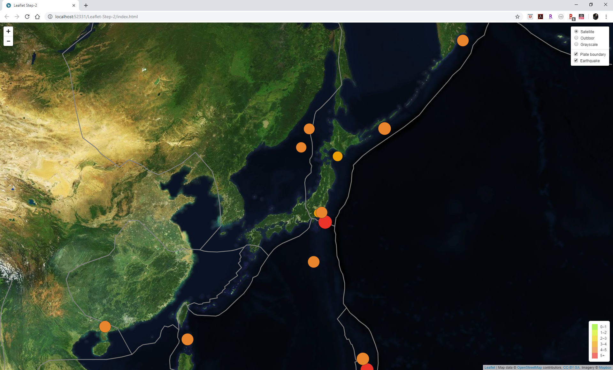

# Leaflet Homework - Visualizing Data with Leaflet
### HW 17

## Objective
Vizualize earthquakes that occured during the last 7 days using [Leaflet](https://leafletjs.com/examples.html).

## Data
Data are provided by [United States Geological Survey](https://www.usgs.gov/) (USGS). They are updated ervery minutes and are in [GeoJson](https://geojson.org/) format.

## Methodology
Data are vizualized using [Leaflet](https://leafletjs.com/examples.html).<br>
Main webpage is built in [index.html](../Leaflet-Step-2/index.html). The "logic" part is built in [JavaScript](../Leaflet-Step-2/static/js/logic.js).<br>

First, we built a map with only the earthquakes data and the legend.

<br><br>
Then, we built the final version with the "satellite", "GrayScale" and "Outdoors" views. We added "Plate Boundary" option to visuzalize that earthquakes are mainly occuring at the plate limits.
Plate data are provided by https://github.com/fraxen/tectonicplates.


## Addional options
I added option in the [logic.js](../Leaflet-Step-2/static/js/logic.js) to get:
- a worldwide map


- a map centered on US


- a map centered on Japan



The option can be changed by setting the ```var coord_opt ``` to "US", "JP", "world"